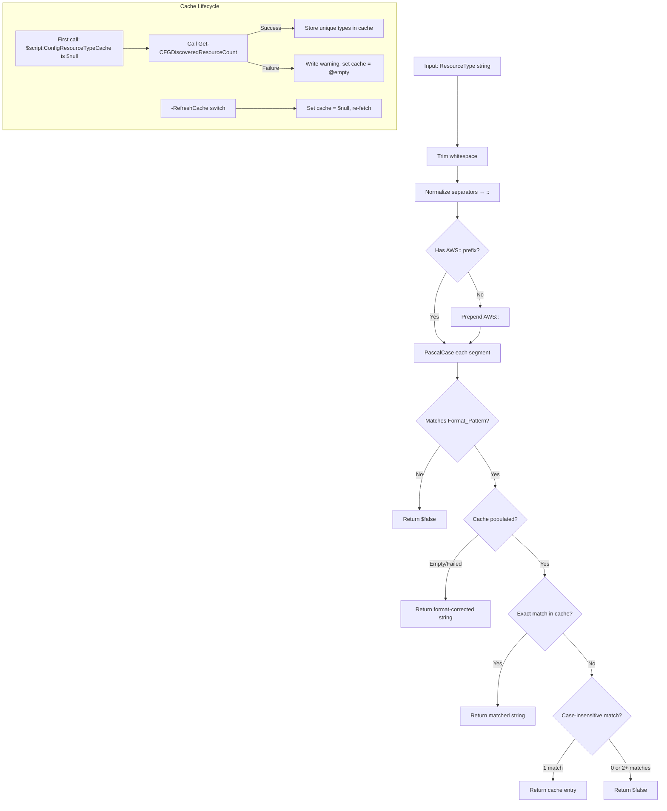

# Design Document: Config Resource Type Validator

## Overview

This design adds `Test-CHARConfigResourceType` to the existing `Config-Operations.psm1` nested module. The function implements a correction-first validation pipeline for AWS Config resource type strings. Rather than simply rejecting malformed input, it attempts to fix common mistakes (casing, separators, missing prefix) before falling back to `$false`. When a dynamically cached list of known resource types is available, the validator also catches typos that pass structural checks but don't correspond to real AWS Config resource types.

The function integrates into the existing module by being called at the top of the `process` block in each Config-Operations function that accepts a `-ResourceType` parameter.

## Architecture



### Design Decisions

1. **Correction-first over reject-first**: The function always attempts to fix input before returning `$false`. This eliminates a class of "silent failure" bugs where a user passes `aws::ec2::instance` and gets no results from Config APIs without understanding why.

2. **Module-scoped lazy cache**: The resource type list is fetched once per module session, not per function call. This avoids repeated API calls while keeping the list current for the session lifetime. The `-RefreshCache` switch provides an escape hatch.

3. **Format-only fallback**: When the API call to populate the cache fails (no credentials, no connectivity), the validator degrades gracefully to structural validation only. It never blocks the user from proceeding with a format-valid string.

4. **Return `$false` instead of throwing**: The validator is designed as a pre-flight check. Callers decide how to handle `$false` — existing functions throw terminating errors, but standalone callers may handle it differently.

## Components and Interfaces

### Test-CHARConfigResourceType (Public Function)

```powershell
function Test-CHARConfigResourceType {
    [CmdletBinding()]
    [OutputType([object])]
    [Diagnostics.CodeAnalysis.SuppressMessageAttribute('PSUsePSCredentialType', '',
        Justification = 'AWS functions use Amazon.Runtime.AWSCredentials, not PSCredential')]
    param(
        [Parameter(Mandatory, ValueFromPipeline, ValueFromPipelineByPropertyName)]
        [AllowNull()]
        [AllowEmptyString()]
        [string]$ResourceType,

        [Parameter()]
        [switch]$RefreshCache,

        # AWS common parameters (used only for cache population)
        [Parameter()]
        [string]$Region,

        [Parameter()]
        [string]$ProfileName,

        [Parameter()]
        [string]$AccessKey,

        [Parameter()]
        [string]$SecretKey,

        [Parameter()]
        [string]$SessionToken,

        [Parameter()]
        [object]$Credential,

        [Parameter()]
        [string]$ProfileLocation,

        [Parameter()]
        [string]$EndpointUrl
    )

    begin {
        $awsParams = New-AWSParamSplat -BoundParameters $PSBoundParameters
    }

    process {
        # Correction pipeline: trim → normalize separators → prepend prefix → PascalCase → regex → enum
        # Returns [string] on success, $false on failure
    }
}
```

### Module-Scoped Cache Variable

Initialized at the top of `Config-Operations.psm1` (after the module help comment, before any function definitions):

```powershell
$script:ConfigResourceTypeCache = $null
```

### Integration Pattern in Existing Functions

Each function that accepts `-ResourceType` adds this block at the top of its `process` block:

```powershell
$validatedType = Test-CHARConfigResourceType -ResourceType $ResourceType @awsParams
if ($validatedType -eq $false) {
    Write-Error "Invalid resource type '$ResourceType' — could not be corrected to a valid AWS Config resource type." -ErrorAction Stop
    return
}
if ($validatedType -ne $ResourceType) {
    Write-Verbose "Corrected ResourceType from '$ResourceType' to '$validatedType'."
    $ResourceType = $validatedType
}
```

Affected functions:
- `Get-CHARConfigResourceCreationDate`
- `Get-CHARConfigResourceDeleteDate`
- `Get-CHARConfigResourceComplianceReport`

Note: `Get-CHARConfigNonCompliantResource` is excluded because it accepts `-ConfigRuleName`, not `-ResourceType`.

### Export-ModuleMember Update

The `Export-ModuleMember` line at the bottom of `Config-Operations.psm1` adds `'Test-CHARConfigResourceType'` to the function list.

### Module Manifest Update

`CharlandCustomizations.psd1` adds `'Test-CHARConfigResourceType'` to the `FunctionsToExport` array.

## Data Models

### Cache Variable Structure

```powershell
# $script:ConfigResourceTypeCache states:
# $null            — not yet populated (will trigger API call)
# @()              — API call failed (format-only mode, no retry until -RefreshCache)
# @('AWS::EC2::Instance', 'AWS::S3::Bucket', ...) — populated successfully
```

### Correction Pipeline Internal State

The correction pipeline operates on a single string variable, mutating it through each stage:

| Stage | Operation | Example |
|-------|-----------|---------|
| 1. Trim | Remove leading/trailing whitespace | `"  aws::ec2::instance  "` → `"aws::ec2::instance"` |
| 2. Normalize separators | Replace `(?<!:):(?!:)` with `::` | `"AWS:EC2:Instance"` → `"AWS::EC2::Instance"` |
| 3. Prepend prefix | If not starting with `AWS::` (case-insensitive check), prepend | `"EC2::Instance"` → `"AWS::EC2::Instance"` |
| 4. PascalCase | Uppercase first char of each `::` segment, preserve rest | `"aws::ec2::instance"` → `"Aws::Ec2::Instance"` then refined via cache |
| 5. Format check | Validate against `^AWS::[A-Z][a-zA-Z0-9]+::[A-Z][a-zA-Z0-9]+$` | Pass or return `$false` |
| 6. Enum check | Match against cache (exact → case-insensitive → reject) | Return matched entry or `$false` |

### PascalCase Logic Detail

PascalCase normalization uppercases only the first character of each segment and preserves the rest. The first segment is always forced to literal `"AWS"` (not just PascalCased) since it's a fixed prefix. For the service and resource segments:

```powershell
# For each segment after splitting on '::'
$segment = $segment.Substring(0, 1).ToUpper() + $segment.Substring(1)
```

This handles `ec2` → `Ec2`, `instance` → `Instance`. The actual correct casing (e.g., `EC2` not `Ec2`) is resolved by the cache lookup step — the case-insensitive match against the cached enum returns the authoritative casing.

### Separator Normalization Regex

The regex `(?<!:):(?!:)` matches a single colon that is neither preceded nor followed by another colon. This correctly handles:
- `AWS:EC2:Instance` → replaces all `:` with `::`
- `AWS::EC2:Instance` → replaces only the single `:` between EC2 and Instance
- `AWS::EC2::Instance` → no replacements (already correct)

Implementation in PowerShell:
```powershell
$value = $value -replace '(?<!:):(?!:)', '::'
```

## Correctness Properties

*A property is a characteristic or behavior that should hold true across all valid executions of a system — essentially, a formal statement about what the system should do. Properties serve as the bridge between human-readable specifications and machine-verifiable correctness guarantees.*

### Property 1: Output Format Invariant

*For any* input string passed to the validator (in format-only mode with empty cache), if the return value is not `$false`, then the returned string MUST match the regex `^AWS::[A-Z][a-zA-Z0-9]+::[A-Z][a-zA-Z0-9]+$`.

**Validates: Requirements 1.7, 1.8**

### Property 2: Correction Idempotence

*For any* input string that produces a non-`$false` result, passing that result through the validator again (in format-only mode) SHALL return the same string unchanged. That is: `f(f(x)) == f(x)` for all inputs where `f(x) ≠ $false`.

**Validates: Requirements 1.1, 1.2**

### Property 3: Whitespace Invariance

*For any* input string `s` and any amount of leading/trailing whitespace `w`, the validator SHALL produce the same result for `w + s + w` as it does for `s`. That is: `f(trim(x)) == f(x)` for all inputs.

**Validates: Requirements 1.6**

### Property 4: Invalid Input Rejection

*For any* input string that contains non-alphanumeric characters within segments (after separators are normalized), has segments beginning with a digit, or has fewer than two meaningful segments after the `AWS::` prefix, the validator SHALL return `$false`.

**Validates: Requirements 1.8, 1.9**

### Property 5: No-Throw Guarantee

*For any* input value (including `$null`, empty string, random binary-like strings, extremely long strings), the validator SHALL never throw a terminating error. It SHALL always return either a valid string or `$false`.

**Validates: Requirements 1.10**

### Property 6: Cache-Based Case Correction

*For any* valid resource type string in the cached list, and any case variation of that string that produces the same value under case-insensitive comparison, the validator SHALL return the exact string from the cache (authoritative casing).

**Validates: Requirements 2.9, 2.10**

### Property 7: Non-Existent Type Rejection with Populated Cache

*For any* string that passes format validation but does not match any entry in a populated (non-empty) cache under case-insensitive comparison, the validator SHALL return `$false`.

**Validates: Requirements 2.11**

### Property 8: Pipeline Independence

*For any* array of N input strings piped to the validator, the function SHALL produce exactly N output values, and the i-th output SHALL be identical to calling the validator with only the i-th input.

**Validates: Requirements 3.5, 3.6**

## Error Handling

### Validator Error Strategy

| Scenario | Behavior |
|----------|----------|
| Invalid/unfixable input | Return `$false` — never throw |
| `$null` / empty / whitespace-only | Return `$false` |
| Cache API call fails (any exception) | `Write-Warning` with explanation, set cache to `@()`, return format-corrected string |
| `Get-CFGDiscoveredResourceCount` not available | Caught by the cache population try/catch, treated same as API failure |

### Caller Error Strategy (Existing Functions)

When an existing function receives `$false` from the validator:
```powershell
Write-Error "Invalid resource type '$ResourceType' — could not be corrected to a valid AWS Config resource type." -ErrorAction Stop
```

This is a terminating error because the function cannot proceed without a valid resource type — the AWS API call would fail with a cryptic error otherwise.

### Cache Population Error Isolation

The `Test-CHARAWSCmdlet` check for `Get-CFGDiscoveredResourceCount` is performed inside the cache population block only (not in `begin`), because:
1. The validator should work even without AWS.Tools.ConfigService installed (format-only mode)
2. The cmdlet check is only needed when actually populating the cache

```powershell
# Inside cache population logic
try {
    @('Get-CFGDiscoveredResourceCount') | Test-CHARAWSCmdlet | Out-Null
    $results = Get-CFGDiscoveredResourceCount @awsParams
    $script:ConfigResourceTypeCache = @($results | Select-Object -ExpandProperty ResourceType -Unique)
}
catch {
    Write-Warning "Could not populate AWS Config resource type cache: $($_.Exception.Message). Falling back to format-only validation."
    $script:ConfigResourceTypeCache = @()
}
```

## Testing Strategy

### Dual Testing Approach

- **Unit tests (Pester 5)**: Specific examples, edge cases, error handling paths, mock-based integration
- **Property-based tests (Pester 5 with data-driven tests)**: Universal properties verified across generated inputs

### Property-Based Testing Library

PowerShell lacks a dedicated PBT library like Hypothesis or QuickCheck. The testing strategy uses Pester's `It` blocks with programmatic input generation via helper functions that produce randomized test data. Each property test iterates 100+ generated inputs.

```powershell
# Example pattern for property tests in Pester
It 'Property 1: Output format invariant - any non-$false output matches Format_Pattern' {
    $formatPattern = '^AWS::[A-Z][a-zA-Z0-9]+::[A-Z][a-zA-Z0-9]+$'
    foreach ($input in (New-RandomResourceTypeInput -Count 100)) {
        $result = Test-CHARConfigResourceType -ResourceType $input
        if ($result -ne $false) {
            $result | Should -Match $formatPattern -Because "Input '$input' produced '$result' which must match Format_Pattern"
        }
    }
}
```

### Test Configuration

- Minimum 100 iterations per property test (randomized input generation)
- Each property test references its design document property via comment tag
- Tag format: **Feature: config-resource-type-validator, Property {number}: {property_text}**

### Test File Location

`tests/src/Public/AWS/Config/Config-Operations/Test-CHARConfigResourceType.Tests.ps1`

### Test Organization

```
Describe 'Test-CHARConfigResourceType' -Tag 'Unit' {
    Context 'Correction Pipeline - Format-Only Mode' {
        # Properties 1-5: Format invariant, idempotence, whitespace, rejection, no-throw
        # Example-based tests for specific correction scenarios
    }
    Context 'Cache-Based Validation' {
        # Properties 6-7: Cache correction, non-existent rejection
        # Mock Get-CFGDiscoveredResourceCount
    }
    Context 'Pipeline Behavior' {
        # Property 8: Pipeline independence
    }
    Context 'Cache Lifecycle' {
        # Integration tests: lazy load, reuse, refresh, failure fallback
    }
    Context 'Edge Cases' {
        # $null, empty, whitespace-only, ambiguous matches, extremely long strings
    }
}
```

### Unit Test Balance

Unit tests focus on:
- Specific correction examples (one per correction type from requirements)
- Integration with existing functions (mock validator return values)
- Cache lifecycle scenarios (populate, reuse, refresh, failure)
- Edge cases (`$null`, ambiguous matches)

Property tests focus on:
- Universal invariants across all generated inputs (format validity, idempotence, no-throw)
- Comprehensive input coverage through randomization

### Input Generators

Helper functions for property tests:

| Generator | Purpose |
|-----------|---------|
| `New-RandomValidResourceType` | Produces strings matching Format_Pattern |
| `New-RandomMiscasedResourceType` | Valid structure with random casing |
| `New-RandomInvalidResourceType` | Strings guaranteed to be unfixable |
| `New-RandomWhitespacePadded` | Wraps valid inputs with random whitespace |
| `New-RandomSeparatorVariant` | Valid segments joined by `:` or `::` randomly |
