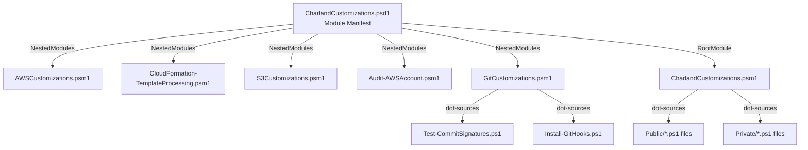

# Design Document: Hardcode Command Prefix

## Overview

This design describes the approach for removing the `DefaultCommandPrefix = 'CC'` setting from the module manifest and hardcoding the "CC" prefix directly into the noun portion of every public function name. The goal is to make exported command names explicit in source code rather than relying on PowerShell's implicit prefix mechanism.

The change is a coordinated rename across function definitions, file names, export lists, help documentation, test files, and markdown documentation. The rename must be atomic — all changes applied together to avoid a broken intermediate state.

## Architecture

The module's current architecture remains unchanged. The only modification is to naming conventions:

**Key architectural facts:**
- The manifest's `FunctionsToExport` controls what's visible to users
- Nested modules use `Export-ModuleMember` to declare their exports
- The root module dot-sources standalone `.ps1` files from `Public/`
- `GitCustomizations.psm1` dot-sources its `.ps1` files by relative path
- Private functions (e.g., `New-AWSParamSplat`) are NOT exported and NOT renamed

## Components and Interfaces

### Affected Components

| Component | Change Type | Description |
|-----------|-------------|-------------|
| `CharlandCustomizations.psd1` | Modify | Remove `DefaultCommandPrefix`, update `FunctionsToExport` |
| `AWSCustomizations.psm1` | Modify | Rename 11 function definitions |
| `CloudFormation-TemplateProcessing.psm1` | Modify | Rename 6 function definitions, update `Export-ModuleMember` |
| `S3Customizations.psm1` | Modify | Rename 1 function definition, update `Export-ModuleMember` |
| `Audit-AWSAccount.psm1` | Modify | Rename 12 function definitions, update `Export-ModuleMember` |
| `GitCustomizations.psm1` | Modify | Update dot-source paths, update `Export-ModuleMember` |
| Standalone `.ps1` files (7 total) | Rename + Modify | Rename files and function definitions |
| Test files | Rename + Modify | Update function references and file paths |
| Documentation `.md` files | Modify | Update all function name references |

### Rename Mapping

The CC prefix is inserted at the start of the noun portion (after the verb-dash):

**Pattern:** `Verb-OriginalNoun` → `Verb-CCOriginalNoun`

**Complete mapping (37 public functions):**

#### Standalone .ps1 files (Public/):
| Old Function | New Function | Old File | New File |
|---|---|---|---|
| `Clear-AuthenticodeSignature` | `Clear-CCAuthenticodeSignature` | `Clear-AuthenticodeSignature.ps1` | `Clear-CCAuthenticodeSignature.ps1` |
| `Install-ProfilesFromSource` | `Install-CCProfilesFromSource` | `Install-ProfilesFromSource.ps1` | `Install-CCProfilesFromSource.ps1` |
| `Invoke-ScriptMultiAccountRegion` | `Invoke-CCScriptMultiAccountRegion` | `Invoke-ScriptMultiAccountRegion.ps1` | `Invoke-CCScriptMultiAccountRegion.ps1` |
| `Set-FileSignature` | `Set-CCFileSignature` | `Set-FileSignature.ps1` | `Set-CCFileSignature.ps1` |
| `Update-Powershell7` | `Update-CCPowershell7` | `Update-Powershell7.ps1` | `Update-CCPowershell7.ps1` |

#### Git .ps1 files (Public/Git/):
| Old Function | New Function | Old File | New File |
|---|---|---|---|
| `Test-CommitSignatures` | `Test-CCCommitSignatures` | `Test-CommitSignatures.ps1` | `Test-CCCommitSignatures.ps1` |
| `Install-GitHooks` | `Install-CCGitHooks` | `Install-GitHooks.ps1` | `Install-CCGitHooks.ps1` |

#### AWSCustomizations.psm1 (11 functions):
| Old | New |
|---|---|
| `Get-AWSMFASession` | `Get-CCAWSMFASession` |
| `Find-CFNStackError` | `Find-CCCFNStackError` |
| `Set-AWSProfileWithMFA` | `Set-CCAWSProfileWithMFA` |
| `Set-AWSEnv` | `Set-CCAWSEnv` |
| `Remove-ExpiredAWSProfiles` | `Remove-CCExpiredAWSProfiles` |
| `Get-AccountListFromProfiles` | `Get-CCAccountListFromProfiles` |
| `Start-MultiStackDriftDetection` | `Start-CCMultiStackDriftDetection` |
| `Get-AWSAccountListOfDriftedResources` | `Get-CCAWSAccountListOfDriftedResources` |
| `Get-AWSObjectCount` | `Get-CCAWSObjectCount` |
| `Use-AssumedRole` | `Use-CCAssumedRole` |
| `Update-SSOCredentialList` | `Update-CCSSOCredentialList` |

#### CloudFormation-TemplateProcessing.psm1 (6 functions):
| Old | New |
|---|---|
| `New-CFNStackFromDirectory` | `New-CCCFNStackFromDirectory` |
| `Test-CFNStackFromDirectory` | `Test-CCCFNStackFromDirectory` |
| `Out-CFNStackInfo` | `Out-CCCFNStackInfo` |
| `Update-CFNStackFromDirectory` | `Update-CCCFNStackFromDirectory` |
| `New-CFNStackDirectory` | `New-CCCFNStackDirectory` |
| `Edit-CFTTEbsVolumes` | `Edit-CCCFTTEbsVolumes` |

#### S3Customizations.psm1 (1 function):
| Old | New |
|---|---|
| `Clear-S3Bucket` | `Clear-CCS3Bucket` |

#### Audit-AWSAccount.psm1 (12 functions):
| Old | New |
|---|---|
| `Get-EC2SGInUse` | `Get-CCEC2SGInUse` |
| `Get-EC2Count` | `Get-CCEC2Count` |
| `Find-EC2DBSG` | `Find-CCEC2DBSG` |
| `Out-AWSSupportingInfo` | `Out-CCAWSSupportingInfo` |
| `Out-AWSNetworkingComponent` | `Out-CCAWSNetworkingComponent` |
| `Get-IAMAuditList` | `Get-CCIAMAuditList` |
| `Get-GlobalAuditReportItem` | `Get-CCGlobalAuditReportItem` |
| `Get-EC2KeyTagNameStatus` | `Get-CCEC2KeyTagNameStatus` |
| `Get-EC2SnapshotReport` | `Get-CCEC2SnapshotReport` |
| `Get-EC2VolumeReport` | `Get-CCEC2VolumeReport` |
| `Start-EC2RetryLoop` | `Start-CCEC2RetryLoop` |
| `Find-OpenSecurityGroup` | `Find-CCOpenSecurityGroup` |

### Unchanged Components

- `Private/New-AWSParamSplat.ps1` — private helper, not exported
- `Private/CFNPrivateFunctions.ps1` — private helper, not exported
- Module file structure (directories remain the same)
- Module loading mechanism (dot-sourcing pattern unchanged)

## Data Models

No data model changes. This is purely a naming refactor.

## Error Handling

### Risk: Partial Rename Leaves Module Broken

If the rename is partially applied (e.g., function definition renamed but `FunctionsToExport` not updated), the module will fail to export those functions.

**Mitigation:** All changes are made in a single commit. The implementation tasks are ordered so that each file is fully updated before moving to the next, and the manifest is updated last to match all renamed functions.

### Risk: Internal Cross-References Missed

Functions that call other module functions by name (in strings, script blocks, or help text) could break silently.

**Mitigation:** A grep-based search for all old function names across the entire source tree is performed as a final verification step.

### Risk: Test Files Reference Old Names

Tests that import or call functions by old names will fail.

**Mitigation:** Test files are renamed and updated as part of the same change. A test run after the rename confirms everything passes.

## Testing Strategy

### Approach

This feature is a bulk rename operation — not algorithmic logic with varying inputs. Property-based testing is **not applicable** here because:
- There are no pure functions with input/output behavior to test
- The correctness criterion is "all references are consistently updated" — a binary pass/fail
- The operation is deterministic and doesn't vary with input

### Verification Strategy

1. **PSScriptAnalyzer** — Run against all modified files to catch syntax errors and style violations
2. **Module Import Test** — `Import-Module CharlandCustomizations` must succeed without errors
3. **Export Verification** — `Get-Command -Module CharlandCustomizations` must list all 37 CC-prefixed functions
4. **Existing Pester Tests** — All renamed test files must pass with updated function references
5. **Grep Verification** — Search for any remaining old function names in the source tree (should find zero matches in code files)

### Test File Updates

Test files follow the same rename pattern:
- `Find-CFNStackError.Tests.ps1` → `Find-CCCFNStackError.Tests.ps1`
- `Get-AWSAccountListOfDriftedResources.Tests.ps1` → `Get-CCAWSAccountListOfDriftedResources.Tests.ps1`
- `Get-AWSObjectCount.Tests.ps1` → `Get-CCAWSObjectCount.Tests.ps1`
- `Remove-ExpiredAWSProfiles.Tests.ps1` → `Remove-CCExpiredAWSProfiles.Tests.ps1`
- `Clear-S3Bucket.Tests.ps1` → `Clear-CCS3Bucket.Tests.ps1`
- `Audit-Functions.Tests.ps1` — content updated (filename doesn't match a single function)
- `New-AWSParamSplat.Tests.ps1` — check for references to public functions (private function name stays)

### Implementation Order

The rename is executed in this order to minimize risk:

1. **Rename standalone `.ps1` files** and update function definitions within them
2. **Update nested module function definitions** (`.psm1` files)
3. **Update `Export-ModuleMember` calls** in each nested module
4. **Update `GitCustomizations.psm1` dot-source paths** (references renamed `.ps1` files)
5. **Update `FunctionsToExport`** in the manifest
6. **Remove `DefaultCommandPrefix`** from the manifest
7. **Update help/examples** within function comment-based help
8. **Update internal cross-references** (functions calling other module functions)
9. **Rename and update test files**
10. **Update documentation `.md` files**
11. **Final verification** — import module, check exports, run tests, grep for old names

---

*Generated by Kiro, reviewed by ccharland*
