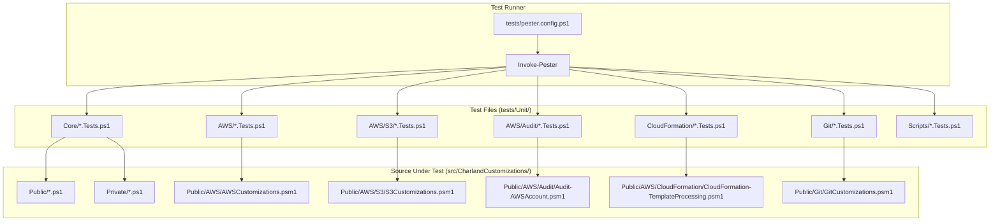

# Design Document: Pester Test Coverage

## Overview

This design defines the architecture, conventions, and implementation strategy for a comprehensive Pester 5+ test suite covering the CharlandCustomizations PowerShell module. The test suite mirrors the source module structure, uses mocks to isolate all external dependencies (AWS, filesystem, git), and targets 80%+ line coverage with descriptive test names.

The design prioritizes:
- **Discoverability**: test files map 1:1 to source functions, organized by functional area
- **Isolation**: every unit test mocks external commands; no live AWS/git/filesystem side effects
- **Speed**: unit tests complete in under 60 seconds via lightweight mocks and tag-based filtering
- **Measurability**: Pester code coverage with JaCoCo export and an 80% threshold gate

## Architecture



### Directory Layout

```
tests/
├── pester.config.ps1              # Pester 5 configuration (run path, tags, coverage)
├── coverage/                      # Generated coverage reports (gitignored)
│   └── coverage.xml               # JaCoCo XML output
├── New-AWSParamSplat.Tests.ps1    # Existing test (preserved at root for backward compat)
└── Unit/
    ├── Core/
    │   ├── Install-ProfilesFromSource.Tests.ps1
    │   ├── Clear-AuthenticodeSignature.Tests.ps1
    │   ├── Set-FileSignature.Tests.ps1
    │   ├── Invoke-ScriptMultiAccountRegion.Tests.ps1
    │   ├── Update-Powershell7.Tests.ps1
    │   └── CFNPrivateFunctions.Tests.ps1
    ├── AWS/
    │   ├── Find-CFNStackErrors.Tests.ps1
    │   ├── Set-AWSProfileWithMFA.Tests.ps1
    │   ├── Set-AWSEnv.Tests.ps1
    │   ├── Remove-ExpiredAWSProfiles.Tests.ps1
    │   ├── Get-AWSObjectCount.Tests.ps1
    │   ├── Use-AssumedRole.Tests.ps1
    │   ├── Update-SSOCredentialList.Tests.ps1
    │   ├── Start-MultiStackDriftDetection.Tests.ps1
    │   ├── Get-AWSAccountListOfDriftedResources.Tests.ps1
    │   ├── S3/
    │   │   └── Clear-S3Bucket.Tests.ps1
    │   └── Audit/
    │       └── Audit-Functions.Tests.ps1
    ├── CloudFormation/
    │   ├── New-CFNStackFromDirectory.Tests.ps1
    │   ├── Test-CFNStackFromDirectory.Tests.ps1
    │   ├── Out-CFNStackInfo.Tests.ps1
    │   ├── Update-CFNStackFromDirectory.Tests.ps1
    │   ├── New-CFNStackDirectory.Tests.ps1
    │   └── Edit-CFTTEbsVolumes.Tests.ps1
    ├── Git/
    │   ├── Test-CommitSignatures.Tests.ps1
    │   └── Install-GitHooks.Tests.ps1
    ├── Scripts/
    │   ├── Build-Module.Tests.ps1
    │   ├── Publish-CharlandCustomizations.Tests.ps1
    │   ├── Register-LocalRepository.Tests.ps1
    │   └── Test-CodeQuality.Tests.ps1
    └── Help/
        └── HelpDiscoverability.Tests.ps1
```

## Components and Interfaces

### Pester Configuration (`tests/pester.config.ps1`)

Central configuration file that returns a `PesterConfiguration` object. All test invocations use this file for consistent behavior.

```powershell
# tests/pester.config.ps1
$config = New-PesterConfiguration

# Run settings
$config.Run.Path = "$PSScriptRoot/Unit"
$config.Run.Exit = $true

# Filter settings — exclude Integration by default
$config.Filter.ExcludeTag = @('Integration')

# Code coverage
$config.CodeCoverage.Enabled = $true
$config.CodeCoverage.Path = @(
    "$PSScriptRoot/../src/CharlandCustomizations/**/*.ps1"
    "$PSScriptRoot/../src/CharlandCustomizations/**/*.psm1"
)
$config.CodeCoverage.CoveragePercentTarget = 80
$config.CodeCoverage.OutputFormat = 'JaCoCo'
$config.CodeCoverage.OutputPath = "$PSScriptRoot/coverage/coverage.xml"

# Output
$config.Output.Verbosity = 'Detailed'

$config
```

### Test File Template

Every test file follows this structure:

```powershell
# Generated by Kiro, reviewed by ccharland
BeforeAll {
    . "$PSScriptRoot/../../src/CharlandCustomizations/Public/FunctionName.ps1"
}

Describe 'FunctionName' -Tag 'Unit' {
    Context 'Happy path' {
        It 'does expected behavior when given valid input' {
            # Arrange
            Mock SomeCommand { return 'mocked' }
            # Act
            $result = FunctionName -Param 'value'
            # Assert
            $result | Should -Be 'expected'
        }
    }

    Context 'Error handling' {
        It 'throws when precondition fails' {
            { FunctionName -BadParam } | Should -Throw '*expected message*'
        }
    }
}
```

### Mocking Strategy

| Dependency Category | Mock Approach | Scope |
|---|---|---|
| AWS cmdlets (`Get-CFNStack`, `Get-STSCallerIdentity`, etc.) | `Mock` returning PSCustomObjects matching AWS output shapes | Per-Context or Per-Describe |
| Filesystem (`Test-Path`, `Get-Content`, `Set-Content`, `Copy-Item`) | `Mock` with `-ParameterFilter` for targeted paths | Per-Context |
| Certificate store (`Get-ChildItem cert:\`) | `Mock` returning fake certificate objects with Issuer/NotAfter | Per-Describe |
| Git commands (`git log`, `git rev-parse`) | `Mock` of the `git` executable or wrapper functions | Per-Context |
| External executables (`winget`, `pwsh`) | `Mock` of `Get-Command` and the executable | Per-Context |
| `ShouldProcess` behavior | Invoke with `-WhatIf` switch; assert downstream mocks are not called | Per-It |

**AWS Mock Pattern:**

```powershell
Mock Get-STSCallerIdentity {
    [PSCustomObject]@{ Account = '123456789012'; Arn = 'arn:aws:iam::123456789012:user/test' }
}

Mock Get-CFNStack {
    @(
        [PSCustomObject]@{ StackName = 'stack1'; StackStatus = 'CREATE_COMPLETE'; StackStatusReason = 'completed' }
        [PSCustomObject]@{ StackName = 'stack2'; StackStatus = 'UPDATE_COMPLETE'; StackStatusReason = $null }
    )
}
```

**ShouldProcess Pattern:**

```powershell
It 'does not call Remove-S3Object during -WhatIf' {
    Mock Remove-S3Object {}
    Mock Get-S3Version { @([PSCustomObject]@{ Key = 'file.txt'; VersionId = 'v1' }) }

    Clear-S3Bucket -BucketName 'test-bucket' -WhatIf

    Should -Not -Invoke Remove-S3Object
}
```

### Help Discoverability Tests

A single test file iterates over all exported functions from the manifest:

```powershell
# tests/Unit/Help/HelpDiscoverability.Tests.ps1
BeforeAll {
    $manifest = Import-PowerShellDataFile "$PSScriptRoot/../../../src/CharlandCustomizations/CharlandCustomizations.psd1"
    $exportedFunctions = $manifest.FunctionsToExport
}

Describe 'Help Discoverability' -Tag 'Help' {
    foreach ($functionName in $exportedFunctions) {
        Context "$functionName" {
            It 'has a non-empty Synopsis' { ... }
            It 'has a non-empty Description' { ... }
            It 'has at least one Example' { ... }
        }
    }
}
```

### Tagging Strategy

| Tag | Purpose | Default Run |
|---|---|---|
| `Unit` | Isolated function tests with mocks | ✅ Included |
| `Help` | Comment-based help validation | ✅ Included |
| `Integration` | Real AWS/git/filesystem interactions | ❌ Excluded |

The Pester configuration excludes `Integration` by default. Running `Invoke-Pester -Tag Integration` explicitly opts in.

## Data Models

### Test Fixture Data

Tests use inline PSCustomObjects rather than external fixture files. This keeps tests self-contained and readable.

**AWS Stack Fixture:**
```powershell
$mockStacks = @(
    [PSCustomObject]@{
        StackName        = 'app-stack'
        StackStatus      = 'CREATE_COMPLETE'
        StackStatusReason = 'Resource creation complete'
    }
    [PSCustomObject]@{
        StackName        = 'failed-stack'
        StackStatus      = 'ROLLBACK_COMPLETE'
        StackStatusReason = $null
    }
)
```

**Certificate Fixture:**
```powershell
$mockCert = [PSCustomObject]@{
    Issuer        = 'CN=Sectigo RSA Code Signing CA, O=Sectigo Limited, L=Salford'
    NotAfter      = (Get-Date).AddYears(1)
    HasPrivateKey = $true
    Thumbprint    = 'AABBCCDD'
}
```

**Stack Directory Fixture:**
Tests that need filesystem state use `TestDrive:\` (Pester's temporary drive) to create isolated directory structures:

```powershell
BeforeEach {
    New-Item -Path "TestDrive:\my-stack" -ItemType Directory
    Set-Content -Path "TestDrive:\my-stack\template.template" -Value '{"AWSTemplateFormatVersion":"2010-09-09"}'
    Set-Content -Path "TestDrive:\my-stack\parameters.json" -Value '[]'
}
```

## Correctness Properties

*A property is a characteristic or behavior that should hold true across all valid executions of a system — essentially, a formal statement about what the system should do. Properties serve as the bridge between human-readable specifications and machine-verifiable correctness guarantees.*

### Property 1: Clear-AuthenticodeSignature content preservation

*For any* file content string, if the content contains a `# SIG # Begin signature block` marker, then after invoking `Clear-AuthenticodeSignature`, the resulting file content SHALL equal the original content up to (but not including) the signature marker, with trailing whitespace trimmed. If the content does not contain the marker, the file content SHALL remain byte-for-byte unchanged.

**Validates: Requirements 2.3, 8.4**

### Property 2: Invoke-ScriptMultiAccountRegion N×M execution count

*For any* set of N successfully-authenticating profiles and M regions, the ScriptBlock passed to `Invoke-ScriptMultiAccountRegion` SHALL execute exactly N × M times.

**Validates: Requirements 2.8**

### Property 3: Invoke-ScriptMultiAccountRegion output enrichment

*For any* profile/region combination where `-IncludeAccountId` is specified, every output object SHALL contain an `AccountId` property whose value equals the account ID returned by `Get-STSCallerIdentity` for that profile.

**Validates: Requirements 2.9**

### Property 4: Find-CFNStackErrors filtering

*For any* collection of CloudFormation stacks, `Find-CFNStackErrors` SHALL return only those stacks whose `StackStatusReason` property is non-null, and SHALL exclude all stacks with a null `StackStatusReason`.

**Validates: Requirements 3.2**

### Property 5: Start-MultiStackDriftDetection eligibility filtering

*For any* set of stack names, `Start-MultiStackDriftDetection` SHALL call `Start-CFNStackDriftDetection` only for stacks whose status is NOT in (`ROLLBACK_COMPLETE`, `DELETE_FAILED`, `ROLLBACK_FAILED`), and SHALL skip all stacks in those excluded statuses.

**Validates: Requirements 3.6, 3.7**

### Property 6: Get-AWSAccountListOfDriftedResources drift status filtering

*For any* collection of stack resources with varying drift statuses, `Get-AWSAccountListOfDriftedResources` SHALL return only resources with drift status `MODIFIED` or `DELETED`, and SHALL exclude resources with status `NOT_MODIFIED` or `IN_SYNC`.

**Validates: Requirements 3.8**

### Property 7: CFNStackDirectoryInfo.ValidateForDeploy correctness

*For any* directory path and any subset of required files (`template.template`, `parameters.json`) that are absent, `ValidateForDeploy` SHALL return an array containing exactly the names of the missing files. When all required files are present, the returned array SHALL be empty.

**Validates: Requirements 6.2, 6.3**

### Property 8: CFNStackDirectoryInfo.GetStackExportPath construction

*For any* combination of RootPath, AccountID, Region, and StackName strings, `GetStackExportPath` SHALL return the platform-appropriate path equivalent to `Join-Path RootPath AccountID Region StackName`.

**Validates: Requirements 6.4**

### Property 9: Help discoverability for all exported functions

*For any* function listed in the module manifest's `FunctionsToExport` array, `Get-Help` SHALL return a result where Synopsis is non-null, non-empty, and does not match the auto-generated pattern; Description is non-null and non-empty; and at least one Example is present.

**Validates: Requirements 7.1, 7.2, 7.3, 7.4**

### Property 10: Edit-CFTTEbsVolumes text replacement completeness

*For any* CloudFormation template body containing one or more occurrences of OldVolumeType, after `Edit-CFTTEbsVolumes` executes, the resulting template body SHALL contain zero occurrences of OldVolumeType and all former occurrences SHALL be replaced with NewVolumeType.

**Validates: Requirements 4.6**

### Property 11: Test file structural compliance

*For any* test file in the test suite, the file SHALL: (a) have a first line matching the Kiro attribution comment pattern, (b) follow the naming convention `<FunctionName>.Tests.ps1`, and (c) contain a `BeforeAll` block that dot-sources the corresponding SUT file using a relative path from `$PSScriptRoot`.

**Validates: Requirements 1.2, 1.3, 1.4**

### Property 12: Test tagging compliance

*For any* unit test file, all `Describe` blocks SHALL include the `Unit` tag. *For any* help test file, all `Describe` blocks SHALL include the `Help` tag. *For any* integration test file, all `Describe` blocks SHALL include the `Integration` tag.

**Validates: Requirements 10.1, 10.2, 10.3**

## Error Handling

### Test-Level Error Handling

- Tests that validate error paths use `Should -Throw` for terminating errors and `Should -Invoke Write-Error` for non-terminating errors
- Each error-path test verifies the error message contains actionable information (file path, profile name, or specific failure reason)
- Tests use `-ErrorAction Stop` when they need to convert non-terminating errors to terminating for assertion

### Mock Failure Simulation

```powershell
# Simulate AWS API failure
Mock Get-CFNStack { throw [Amazon.CloudFormation.AmazonCloudFormationException]::new('Access Denied') }

# Simulate filesystem failure
Mock Test-Path { return $false } -ParameterFilter { $Path -eq $targetFile }

# Simulate git failure
Mock git { throw 'fatal: not a git repository' }
```

### Coverage Gaps and Exceptions

Functions that cannot achieve full coverage in unit tests (e.g., `Update-Powershell7` platform-specific paths) are documented with a release exception in the test file:

```powershell
# NOTE: Linux/macOS code paths not covered in unit tests.
# Platform-specific behavior validated via manual smoke test on target OS.
```

## Testing Strategy

### Dual Testing Approach

- **Unit tests (example-based)**: Verify specific scenarios, error paths, ShouldProcess behavior, and parameter contracts. These form the bulk of the test suite.
- **Property tests**: Verify universal invariants across generated inputs for pure functions and filtering logic (Properties 1–12 above).

### Property-Based Testing Configuration

**Library**: No dedicated PBT library is used. PowerShell lacks a mature PBT framework equivalent to QuickCheck/Hypothesis. Instead, property tests are implemented as parameterized Pester tests using `foreach` loops over generated input arrays (minimum 100 iterations) with randomized data from helper functions.

**Pattern:**
```powershell
Describe 'Clear-AuthenticodeSignature' -Tag 'Unit' {
    Context 'Property: content preservation' {
        # Feature: pester-test-coverage, Property 1: content preservation
        It 'preserves content before signature block for random content' {
            foreach ($i in 1..100) {
                $randomContent = -join ((65..90) + (97..122) | Get-Random -Count (Get-Random -Min 10 -Max 200) | ForEach-Object { [char]$_ })
                $signature = "`n# SIG # Begin signature block`nMIIr0AYJ..."
                $fileContent = "$randomContent$signature"

                # Write to TestDrive, invoke, verify
                Set-Content "TestDrive:\test$i.ps1" -Value $fileContent -NoNewline
                Clear-AuthenticodeSignature -Path "TestDrive:\test$i.ps1"
                $result = Get-Content "TestDrive:\test$i.ps1" -Raw
                $result | Should -Be $randomContent.TrimEnd()
            }
        }
    }
}
```

**Tag format**: Each property test includes a comment: `# Feature: pester-test-coverage, Property {N}: {title}`

### Test Execution Commands

```powershell
# Run all unit + help tests (default, excludes Integration)
Invoke-Pester -Configuration (. ./tests/pester.config.ps1)

# Run only unit tests
Invoke-Pester -Path ./tests/Unit -Tag Unit

# Run only help tests
Invoke-Pester -Path ./tests/Unit -Tag Help

# Run integration tests (opt-in)
Invoke-Pester -Path ./tests -Tag Integration

# Run with coverage report
Invoke-Pester -Configuration (. ./tests/pester.config.ps1)
# Coverage XML written to tests/coverage/coverage.xml
```

### Test Priority Order

Implementation follows the risk-based priority from TEST-PLAN.md:

1. **P1 Release Blockers**: `Clear-S3Bucket`, `Set-FileSignature`, `Clear-AuthenticodeSignature`, `Invoke-ScriptMultiAccountRegion`, `Install-GitHooks`, `New-CFNStackFromDirectory`, `Update-CFNStackFromDirectory`
2. **P2 Core Workflows**: `Find-CFNStackErrors`, `Start-MultiStackDriftDetection`, `Get-AWSObjectCount`, `Test-CommitSignatures`
3. **P3 Audit/Reporting**: `Install-ProfilesFromSource`, `Update-Powershell7`, audit functions
4. **Help tests**: Single file covering all exported functions
5. **Script tests**: Build, publish, and quality scripts

### Coverage Target

- **Goal**: 80% line coverage across all `.ps1` and `.psm1` files under `src/CharlandCustomizations/`
- **Measurement**: Pester's built-in code coverage with JaCoCo XML export
- **Gate**: CI fails if coverage drops below 80%
- **Exclusions**: Platform-specific code paths (Windows-only winget calls) documented as release exceptions
