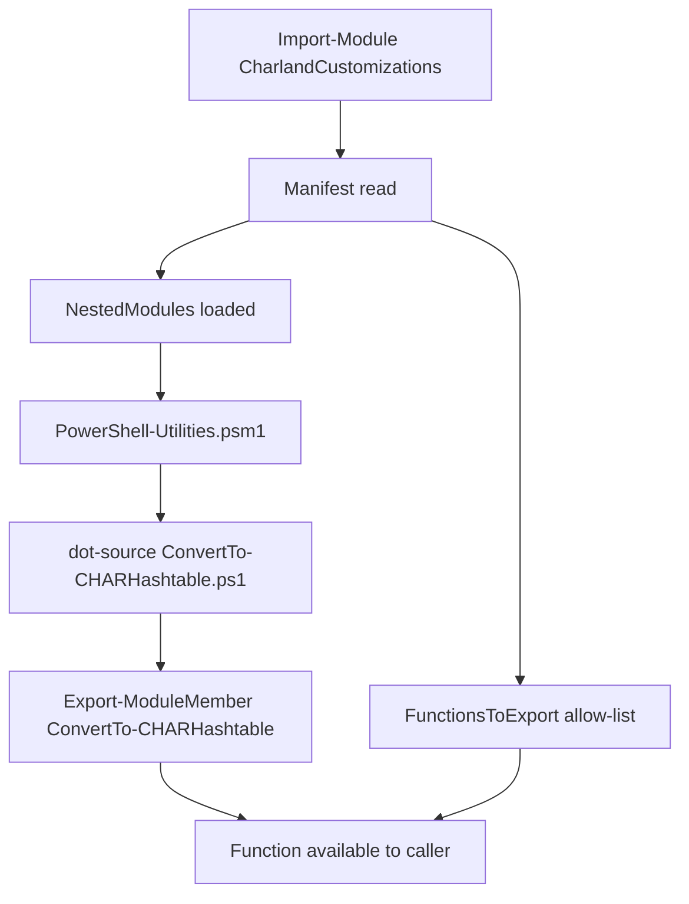
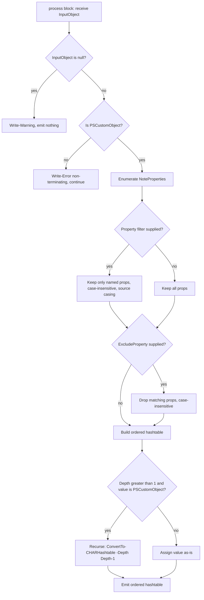

# Design Document

## Overview

This design introduces a new `PowerShell-Utilities` nested module to the
CharlandCustomizations project, whose first function is `ConvertTo-CHARHashtable`.
The function converts `PSCustomObject` instances into ordered hashtables so they can be
consumed by the PowerShell splatting operator (`@variable`). This solves a recurring
friction point: pipeline-produced `PSCustomObject`s cannot be splatted directly against a
cmdlet's parameters.

The design deliberately mirrors the existing `Public/Git/GitCustomizations.psm1` nested
module pattern so the addition is idiomatic to the project and requires no changes to the
root module loader.

## Alignment with Existing Architecture

The project loads functions three ways, and this design respects all three:

1. **Root loader (`CharlandCustomizations.psm1`)** dot-sources `Public/*.ps1` and
   `Private/*.ps1` **non-recursively** — only the top level of each directory. Functions
   living in subdirectories (e.g. `Public/PowerShell/`) are therefore *not* auto-loaded by
   the root loader.
2. **Nested modules (`NestedModules` in the manifest)** are the mechanism for loading
   subdirectory functions. Each subdirectory ships a `.psm1` that dot-sources its own
   `.ps1` files and calls `Export-ModuleMember`.
3. **Manifest `FunctionsToExport`** is the authoritative export allow-list (explicit, no
   wildcards).

`ConvertTo-CHARHashtable` follows path (2): it lives at
`Public/PowerShell/ConvertTo-CHARHashtable.ps1`, is dot-sourced by
`Public/PowerShell/PowerShell-Utilities.psm1`, which is registered in `NestedModules` and
whose function name is added to `FunctionsToExport`.

## Architecture

```
src/CharlandCustomizations/
├── CharlandCustomizations.psd1        (edit: add NestedModules + FunctionsToExport entries)
├── CharlandCustomizations.psm1        (unchanged — loader already handles nested modules)
└── Public/
    └── PowerShell/                    (new directory)
        ├── PowerShell-Utilities.psm1  (new — nested module loader/exporter)
        └── ConvertTo-CHARHashtable.ps1 (new — the function)

tests/Unit/Core/
└── ConvertTo-CHARHashtable.Tests.ps1  (new — Pester v5 unit tests)
```

### Load sequence



## Components and Interfaces

### PowerShell-Utilities.psm1 (nested module)

Mirrors `GitCustomizations.psm1`: a header comment, a dot-source line per sibling `.ps1`,
and an explicit alphabetical `Export-ModuleMember -Function` list. The file will be
Authenticode-signed as part of the build/commit flow like every other module file.

```powershell
# PowerShell language and object utilities.

. $PSScriptRoot/ConvertTo-CHARHashtable.ps1

Export-ModuleMember -Function @(
    'ConvertTo-CHARHashtable'
)
```

### ConvertTo-CHARHashtable (function)

**Signature**

```powershell
function ConvertTo-CHARHashtable {
    [CmdletBinding()]
    [OutputType([System.Collections.Specialized.OrderedDictionary])]
    param(
        [Parameter(ValueFromPipeline = $true)]
        [object] $InputObject,

        [Parameter()]
        [string[]] $Property,

        [Parameter()]
        [string[]] $ExcludeProperty,

        [Parameter()]
        [ValidateRange(1, 100)]
        [int] $Depth = 1
    )
    begin  { ... }
    process { ... }
    end    { ... }
}
```

**Parameters**

| Parameter | Type | Notes |
|-----------|------|-------|
| `InputObject` | `[object]` | Accepts pipeline input by value (`ValueFromPipeline`). Typed as `[object]` — not `[psobject]` — so invalid types reach the `process` block and can be rejected with a descriptive non-terminating error (Req 6.3). |
| `Property` | `[string[]]` | Inclusion filter. Case-insensitive match; original casing preserved as keys (Req 4). Empty array → empty result (Req 4.5). |
| `ExcludeProperty` | `[string[]]` | Exclusion filter, applied after `Property` (Req 5). Exact case-insensitive string comparison, no wildcards. |
| `Depth` | `[int]` | Recursion depth for nested `PSCustomObject` values. Default `1` = shallow (Req 7). `ValidateRange(1,100)` guards against pathological recursion. |

**Return type**

Each converted object emits one ordered hashtable
(`[ordered]` / `System.Collections.Specialized.OrderedDictionary`). Ordered preserves the
source property order, which keeps splatting deterministic and diff-friendly.

### Processing logic (per input object)



**Key decisions**

- **Type check:** use `$InputObject -is [System.Management.Automation.PSCustomObject]`.
  A plain `[hashtable]`, string, or primitive is rejected with a non-terminating
  `Write-Error` and the pipeline continues (Req 3.4, 6.3).
- **Null handling:** a `$null` `InputObject` triggers `Write-Warning` and emits nothing
  (Req 6.1). Because binding happens per-item, a `$null` in the middle of a pipeline warns
  and processing continues.
- **Value fidelity:** values are copied by reference without type coercion, so
  `.GetType()` in the result matches the source (Req 2.3). Round-tripping through
  `[pscustomobject]` reproduces the original object (Req 2.5).
- **Ordered output:** properties are added in `psobject.Properties` order.
- **Recursion:** only `PSCustomObject` values recurse. Arrays, hashtables, and primitives
  are passed through untouched even under `-Depth > 1`, matching the requirement's scope
  (nested *PSCustomObject* conversion only). At the depth limit remaining nested objects
  are left unconverted (Req 7.4).
- **Verbose:** each conversion writes a `Write-Verbose` line with the source property
  count (Req 6.4).

## Data Models

There are no persistent data models. The transient shapes are:

- **Source_Object** — an input `PSCustomObject` with zero or more `NoteProperty` members.
- **Result_Hashtable** — an `OrderedDictionary` whose keys are the (filtered) source
  property names and whose values are the corresponding source values (optionally
  recursively converted).

## Error Handling

| Condition | Behavior | Requirement |
|-----------|----------|-------------|
| `InputObject` is `$null` | `Write-Warning`, emit nothing | 6.1 |
| `InputObject` is a non-PSCustomObject type | Non-terminating `Write-Error` naming the expected type; continue pipeline | 3.4, 6.3 |
| Empty object (0 properties) | Return empty ordered hashtable (count 0) | 2.6, 6.2 |
| `Property` names a non-existent prop | Silently omit, no error/warning | 4.2 |
| `ExcludeProperty` names a non-existent prop | Silently ignore, no error/warning | 5.4 |
| `Property` = empty array | Return empty hashtable | 4.5 |
| All props excluded | Return empty ordered hashtable | 5.5 |

All errors are non-terminating (`Write-Error` / `Write-Warning`) so the function is a
well-behaved pipeline citizen and never aborts a batch on a single bad item.

## Testing Strategy

Pester v5 unit tests at `tests/Unit/Core/ConvertTo-CHARHashtable.Tests.ps1`, following the
project convention: `.NOTES` attribution header, a `BeforeAll` that dot-sources the
function under test via relative path, a `Describe` tagged `'Unit'`, and
Context/Arrange-Act-Assert structure.

Required `It` coverage (Req 8.2), one or more per scenario:

1. Basic conversion — object → hashtable with matching keys/values.
2. Pipeline input produces output equivalent to parameter-bound input.
3. Multiple piped objects stream in input order.
4. `-Property` returns only the named keys (case-insensitive, source casing preserved).
5. `-ExcludeProperty` omits named keys.
6. `-Property` + `-ExcludeProperty` combined (filter then exclude).
7. `$null` input emits a Warning-stream message and no output (captured via `3>&1`).
8. Empty object returns an empty hashtable (count 0).
9. Invalid type (string/int/hashtable) produces a non-terminating error
   (captured via `-ErrorVariable`).
10. Nested object at default depth returns the child object unconverted.
11. `-Depth 2` recursively converts one level of nested `PSCustomObject`.
12. Value type fidelity — `.GetType()` preserved; round-trip through `[pscustomobject]`
    reproduces the source.

## Manifest Changes

Two edits to `CharlandCustomizations.psd1`, each preserving alphabetical order:

- **`NestedModules`** — insert `'Public/PowerShell/PowerShell-Utilities.psm1'` after the
  `Public/Git/GitCustomizations.psm1` entry (P > G).
- **`FunctionsToExport`** — insert `'ConvertTo-CHARHashtable'` in alphabetical position
  (between `Clear-CHARS3Bucket` and `Edit-CHARCFTTEbsVolume`).

`ModuleVersion` is intentionally **not** changed here; version bumps are handled at release
time, and this branch's manifest version is stale relative to `main` regardless.

---
Authored by Kiro (Claude Opus 4.8) for the powershell-utilities spec, reviewed by ccharland, on 2026-09-19.
