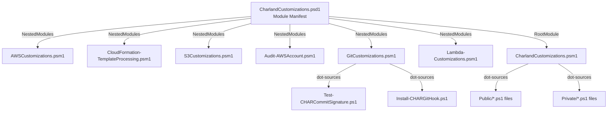

# Design Document: Rename CC Prefix to CHAR

## Overview

This design describes the approach for renaming all public function names from the "CC" prefix to "CHAR" across the CharlandCustomizations PowerShell module. The goal is to avoid potential naming conflicts with AWS modules or cmdlets that may use "CC" as a prefix. "CHAR" is more unique and clearly identifies these as Charland's custom functions.

The change is a coordinated rename across function definitions, file names, export lists, aliases, script variables, help documentation, test files, and markdown documentation. All Authenticode signature blocks will be stripped (files will be re-signed after the rename is complete).

## Architecture

The module's architecture remains unchanged. The only modification is the naming convention for exported functions and aliases:

**Key architectural facts:**
- The manifest's `FunctionsToExport` controls what's visible to users
- Nested modules use `Export-ModuleMember` to declare their exports
- The root module dot-sources standalone `.ps1` files from `Public/` using wildcard glob (no explicit filenames)
- `GitCustomizations.psm1` dot-sources its `.ps1` files by explicit relative path
- Private functions (`New-AWSParamSplat`, `CFNPrivateFunctions`) are NOT exported and NOT renamed (only their comments referencing public functions are updated)

## Components and Interfaces

### Affected Components

| Component | Change Type | Description |
|-----------|-------------|-------------|
| `CharlandCustomizations.psd1` | Modify | Update `FunctionsToExport` and `AliasesToExport` |
| `AWSCustomizations.psm1` | Modify | Rename 11 function definitions, update cross-refs |
| `CloudFormation-TemplateProcessing.psm1` | Modify | Rename 6 function definitions, update `Export-ModuleMember` |
| `S3Customizations.psm1` | Modify | Rename 1 function definition, update `Export-ModuleMember` |
| `Audit-AWSAccount.psm1` | Modify | Rename 13 function definitions, update `Export-ModuleMember` |
| `Lambda-Customizations.psm1` | Modify | Rename 1 function definition, update `Export-ModuleMember` |
| `GitCustomizations.psm1` | Modify | Update dot-source paths, update `Export-ModuleMember` |
| Standalone `.ps1` files (8 total) | Rename + Modify | Rename files and function definitions |
| `Private/CFNPrivateFunctions.ps1` | Modify | Update comment references to public functions |
| Test files (26 total) | Rename + Modify | Update function references and file paths |
| Documentation `.md` files | Modify | Update all function name references |
| Scripts in `Scripts/` | Modify | Update any function name references |

### Rename Mapping

The CC prefix is replaced with CHAR at the start of the noun portion (after the verb-dash):

**Pattern:** `Verb-CC<Noun>` → `Verb-CHAR<Noun>`

**Complete mapping (40 public functions):**

#### Standalone .ps1 files (Public/):
| Old Function | New Function | Old File | New File |
|---|---|---|---|
| `Clear-CCAuthenticodeSignature` | `Clear-CHARAuthenticodeSignature` | `Clear-CCAuthenticodeSignature.ps1` | `Clear-CHARAuthenticodeSignature.ps1` |
| `Install-CCProfilesFromSource` | `Install-CHARProfilesFromSource` | `Install-CCProfilesFromSource.ps1` | `Install-CHARProfilesFromSource.ps1` |
| `Invoke-CCScriptMultiRegionProfile` | `Invoke-CHARScriptMultiRegionProfile` | `Invoke-CCScriptMultiRegionProfile.ps1` | `Invoke-CHARScriptMultiRegionProfile.ps1` |
| `Set-CCAuthenticodeSignature` | `Set-CHARAuthenticodeSignature` | `Set-CCAuthenticodeSignature.ps1` | `Set-CHARAuthenticodeSignature.ps1` |
| `Test-CCAuthenticodeSignature` | `Test-CHARAuthenticodeSignature` | `Test-CCAuthenticodeSignature.ps1` | `Test-CHARAuthenticodeSignature.ps1` |
| `Update-CCPowershell7` | `Update-CHARPowershell7` | `Update-CCPowershell7.ps1` | `Update-CHARPowershell7.ps1` |

#### Git .ps1 files (Public/Git/):
| Old Function | New Function | Old File | New File |
|---|---|---|---|
| `Test-CCCommitSignature` | `Test-CHARCommitSignature` | `Test-CCCommitSignature.ps1` | `Test-CHARCommitSignature.ps1` |
| `Install-CCGitHook` | `Install-CHARGitHook` | `Install-CCGitHook.ps1` | `Install-CHARGitHook.ps1` |

#### AWSCustomizations.psm1 (11 functions):
| Old | New |
|---|---|
| `Get-CCAWSMFASession` | `Get-CHARAWSMFASession` |
| `Find-CCCFNStackError` | `Find-CHARCFNStackError` |
| `Set-CCAWSProfileWithMFA` | `Set-CHARAWSProfileWithMFA` |
| `Set-CCAWSEnv` | `Set-CHARAWSEnv` |
| `Remove-CCExpiredAWSProfile` | `Remove-CHARExpiredAWSProfile` |
| `Get-CCAccountListFromProfile` | `Get-CHARAccountListFromProfile` |
| `Start-CCMultiStackDriftDetection` | `Start-CHARMultiStackDriftDetection` |
| `Get-CCAWSAccountListOfDriftedResource` | `Get-CHARAWSAccountListOfDriftedResource` |
| `Get-CCAWSObjectCount` | `Get-CHARAWSObjectCount` |
| `Use-CCAssumedRole` | `Use-CHARAssumedRole` |
| `Update-CCSSOCredentialList` | `Update-CHARSSOCredentialList` |

#### CloudFormation-TemplateProcessing.psm1 (6 functions):
| Old | New |
|---|---|
| `New-CCCFNStackFromDirectory` | `New-CHARCFNStackFromDirectory` |
| `Test-CCCFNStackFromDirectory` | `Test-CHARCFNStackFromDirectory` |
| `Out-CCCFNStackInfo` | `Out-CHARCFNStackInfo` |
| `Update-CCCFNStackFromDirectory` | `Update-CHARCFNStackFromDirectory` |
| `New-CCCFNStackDirectory` | `New-CHARCFNStackDirectory` |
| `Edit-CCCFTTEbsVolume` | `Edit-CHARCFTTEbsVolume` |

#### S3Customizations.psm1 (1 function):
| Old | New |
|---|---|
| `Clear-CCS3Bucket` | `Clear-CHARS3Bucket` |

#### Lambda-Customizations.psm1 (1 function):
| Old | New |
|---|---|
| `Get-CCDeprecatedLMFunctionList` | `Get-CHARDeprecatedLMFunctionList` |

#### Audit-AWSAccount.psm1 (13 functions):
| Old | New |
|---|---|
| `Get-CCEC2SGInUse` | `Get-CHAREC2SGInUse` |
| `Get-CCEC2Count` | `Get-CHAREC2Count` |
| `Find-CCEC2DBSG` | `Find-CHAREC2DBSG` |
| `Out-CCAWSSupportingInfo` | `Out-CHARAWSSupportingInfo` |
| `Out-CCAWSNetworkingComponent` | `Out-CHARAWSNetworkingComponent` |
| `Get-CCIAMAuditList` | `Get-CHARIAMAuditList` |
| `Get-CCGlobalAuditReportItem` | `Get-CHARGlobalAuditReportItem` |
| `Get-CCEC2KeyTagNameStatus` | `Get-CHAREC2KeyTagNameStatus` |
| `Get-CCEC2SnapshotReport` | `Get-CHAREC2SnapshotReport` |
| `Get-CCEC2VolumeReport` | `Get-CHAREC2VolumeReport` |
| `Start-CCEC2RetryLoop` | `Start-CHAREC2RetryLoop` |
| `Find-CCOpenSecurityGroup` | `Find-CHAROpenSecurityGroup` |
| `Get-CCAllEC2Patch` | `Get-CHARAllEC2Patch` |

#### Aliases:
| Old | New |
|---|---|
| `Set-CCFileSignature` | `Set-CHARFileSignature` |
| `Test-CCAuthenticodeSignatures` | `Test-CHARAuthenticodeSignatures` |

#### Script Variables:
| Old | New |
|---|---|
| `$script:CCIsWindows` | `$script:IsWindows` |

### Unchanged Components

- `Private/New-AWSParamSplat.ps1` — private helper function name stays, only update comments referencing public functions
- `Private/CFNPrivateFunctions.ps1` — private helper, only update comments referencing public functions
- Module file structure (directories remain the same)
- Module loading mechanism (dot-sourcing pattern unchanged)
- `CharlandCustomizations.psm1` — uses wildcard glob for public files, no explicit names to update

## Data Models

No data model changes. This is purely a naming refactor.

## Error Handling

### Risk: Partial Rename Leaves Module Broken

If the rename is partially applied, `FunctionsToExport` won't match actual function definitions.

**Mitigation:** All changes are committed together. Implementation order ensures each file is fully updated before the manifest is updated to match.

### Risk: Internal Cross-References Missed

Functions calling other module functions by name (in strings, script blocks, help text) could reference old names.

**Mitigation:** Final grep verification for remaining "CC" references in code (excluding `.git/`, signature blocks, and base64 noise).

### Risk: Test Files Reference Old Names

Tests importing or calling functions by old CC-prefixed names will fail.

**Mitigation:** Test files are renamed and updated as part of the same change.

### Risk: Signature Block Content Modified

Signature blocks contain base64-encoded data that may coincidentally contain "CC".

**Mitigation:** All signature blocks are stripped entirely (Requirement 11). Files will be re-signed after rename completion.

## Testing Strategy

### Approach

This is a bulk rename operation — no property-based testing is applicable. Verification is binary: either all references are consistently updated or they're not.

### Verification Strategy

1. **Module Import Test** — `Import-Module ./src/CharlandCustomizations -Force` must succeed without errors
2. **Export Verification** — `Get-Command -Module CharlandCustomizations` must list all 40 CHAR-prefixed functions
3. **Pester Tests** — All renamed test files must pass with updated function references
4. **Grep Verification** — Search for remaining `-CC[A-Z]` pattern in source tree (should find zero matches in code files)
5. **PSScriptAnalyzer** — Run against all modified files to catch syntax errors

### Test File Rename Mapping

| Old Test File | New Test File |
|---|---|
| `tests/Unit/AWS/Find-CCCFNStackError.Tests.ps1` | `Find-CHARCFNStackError.Tests.ps1` |
| `tests/Unit/AWS/Get-CCAWSAccountListOfDriftedResource.Tests.ps1` | `Get-CHARAWSAccountListOfDriftedResource.Tests.ps1` |
| `tests/Unit/AWS/Get-CCAWSObjectCount.Tests.ps1` | `Get-CHARAWSObjectCount.Tests.ps1` |
| `tests/Unit/AWS/Remove-CCExpiredAWSProfile.Tests.ps1` | `Remove-CHARExpiredAWSProfile.Tests.ps1` |
| `tests/Unit/AWS/Set-CCAWSEnv.Tests.ps1` | `Set-CHARAWSEnv.Tests.ps1` |
| `tests/Unit/AWS/Set-CCAWSProfileWithMFA.Tests.ps1` | `Set-CHARAWSProfileWithMFA.Tests.ps1` |
| `tests/Unit/AWS/Start-CCMultiStackDriftDetection.Tests.ps1` | `Start-CHARMultiStackDriftDetection.Tests.ps1` |
| `tests/Unit/AWS/Update-CCSSOCredentialList.Tests.ps1` | `Update-CHARSSOCredentialList.Tests.ps1` |
| `tests/Unit/AWS/Use-CCAssumedRole.Tests.ps1` | `Use-CHARAssumedRole.Tests.ps1` |
| `tests/Unit/AWS/S3/Clear-CCS3Bucket.Tests.ps1` | `Clear-CHARS3Bucket.Tests.ps1` |
| `tests/Unit/AWS/Lambda/Get-CCDeprecatedLMFunctionList.Tests.ps1` | `Get-CHARDeprecatedLMFunctionList.Tests.ps1` |
| `tests/Unit/CloudFormation/Edit-CCCFTTEbsVolume.Tests.ps1` | `Edit-CHARCFTTEbsVolume.Tests.ps1` |
| `tests/Unit/CloudFormation/New-CCCFNStackDirectory.Tests.ps1` | `New-CHARCFNStackDirectory.Tests.ps1` |
| `tests/Unit/CloudFormation/New-CCCFNStackFromDirectory.Tests.ps1` | `New-CHARCFNStackFromDirectory.Tests.ps1` |
| `tests/Unit/CloudFormation/Out-CCCFNStackInfo.Tests.ps1` | `Out-CHARCFNStackInfo.Tests.ps1` |
| `tests/Unit/CloudFormation/Test-CCCFNStackFromDirectory.Tests.ps1` | `Test-CHARCFNStackFromDirectory.Tests.ps1` |
| `tests/Unit/CloudFormation/Update-CCCFNStackFromDirectory.Tests.ps1` | `Update-CHARCFNStackFromDirectory.Tests.ps1` |
| `tests/Unit/Core/Clear-CCAuthenticodeSignature.Tests.ps1` | `Clear-CHARAuthenticodeSignature.Tests.ps1` |
| `tests/Unit/Core/Install-CCProfilesFromSource.Tests.ps1` | `Install-CHARProfilesFromSource.Tests.ps1` |
| `tests/Unit/Core/Invoke-CCScriptMultiRegionProfile.Tests.ps1` | `Invoke-CHARScriptMultiRegionProfile.Tests.ps1` |
| `tests/Unit/Core/Set-CCFileSignature.Tests.ps1` | `Set-CHARFileSignature.Tests.ps1` |
| `tests/Unit/Core/Update-CCPowershell7.Tests.ps1` | `Update-CHARPowershell7.Tests.ps1` |
| `tests/Unit/Git/Install-CCGitHook.Tests.ps1` | `Install-CHARGitHook.Tests.ps1` |
| `tests/Unit/Git/Test-CCCommitSignature.Tests.ps1` | `Test-CHARCommitSignature.Tests.ps1` |
| `tests/Unit/AWS/Audit/Get-CCAllEC2Patch.Tests.ps1` | `Get-CHARAllEC2Patch.Tests.ps1` |

### Implementation Order

1. **Strip all Authenticode signature blocks** from all `.ps1` and `.psm1` files
2. **Rename standalone `.ps1` files** and update function definitions + help within them
3. **Update nested module function definitions** (`.psm1` files) and `Export-ModuleMember` calls
4. **Update `GitCustomizations.psm1` dot-source paths**
5. **Update module manifest** (`FunctionsToExport`, `AliasesToExport`)
6. **Update aliases** in source files
7. **Update `$script:CCIsWindows`** → `$script:IsWindows`
8. **Update internal cross-references** (functions calling other module functions)
9. **Update private function comments** that reference public functions
10. **Rename and update test files**
11. **Update documentation `.md` files**
12. **Update Scripts directory** references
13. **Final verification** — import module, check exports, run tests, grep for old names

---

*Generated by Kiro, reviewed by ccharland*
