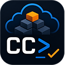

# CharlandCustomizations



This is my public release for my PowerShell module and related automation. These functions are primarily for my own use, and are public so I can easily use them in CloudShell, AWS WorkSpaces, and other environments without needing to clone this repository.

All public commands use the "CHAR" prefix before the noun of the command (e.g., `Find-CHARCFNStackError`, `Set-CHARAWSEnv`)

## Goals

I'm using this project to learn how to build and maintain a PowerShell module, and to share useful functions that I create for my own work. The module is focused on AWS automation, but may include other utilities as well, especially around module deployment, code signing, and PowerShell Gallery publishing.

I'm also working on building a repeatable build and release process, including code signing, packaging, and publishing to the PowerShell Gallery. The goal is to make important steps hard to skip and keep module quality high over time. The more automation, the better.

## Quick start

```powershell
Install-Module CharlandCustomizations -Scope CurrentUser
Import-Module CharlandCustomizations

# Examples
Find-CHARCFNStackError
Set-CHARAWSEnv -ProfileName my-sso-profile
```

## Repository baseline
```
CharlandCustomizations/
    ├── assets/
    ├── docs/
    ├── src/
    │ └── CharlandCustomizations/
    │   ├── CharlandCustomizations.psd1
    │   ├── CharlandCustomizations.psm1
    │   ├── Public/
    │   └── Private/
    ├── Scripts/
    ├── tests/
    └── README.md
```

## Release safety

For release workflow details, see the documentation in [docs/BUILD-PROCESS.md](docs/BUILD-PROCESS.md) and [docs/DISTRIBUTION.md](docs/DISTRIBUTION.md).

High-level guardrails:

- Source signing compliance check before release publication.
- Build and package from the validated module output.
- PowerShell Gallery publishing gated to `main` with an immutable tag check.

## Use of AI:

- AI is my "Intern powered by Red Bull" for code generation, documentation, and automation. I use the tools to do the majority of the work, but I review and edit when needed to make sure everything is working as expected.

- Tools used in this repository include:
  - Kiro
  - GitHub Copilot
  - ChatGPT for generic guidance and Image generation
  - Codex

## Adding components to the module

I want everything tested, documented, and included in the build and release process. This means that I need to add new functions to the module, add tests for those functions, and make sure they are included in the build and release process. My Pull requests will be large until I get the baseline established, but I will try to keep them as small as possible after that, and limit them to one module/function at a time, to keep the AI tools and code reviewers happy with smaller changes.
